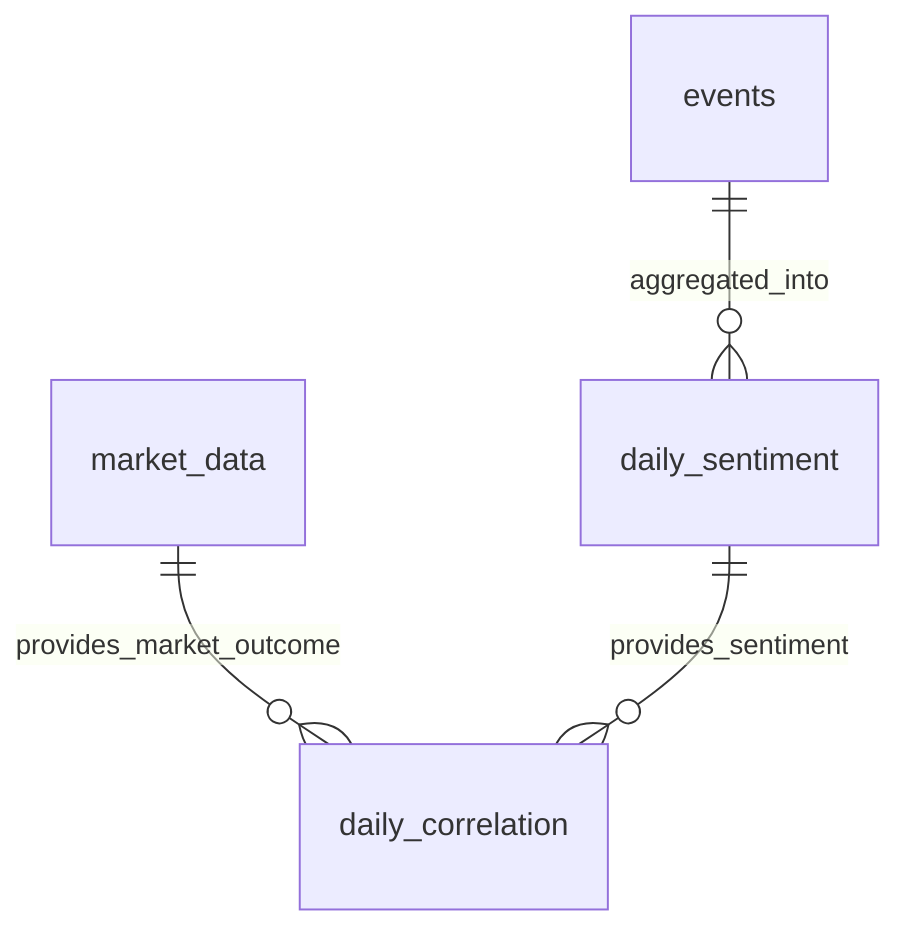

# AI-Pulse Database Schema

## Overview

**Database**: SQLite (`ai_pulse.db`)
**Location**: `/Users/mat.edwards/dev/test-claude/ai-pulse/ai_pulse.db`
**Purpose**: Stores collected events, analysis results, market data, sentiment aggregates, and cost tracking

**Key Design Principles:**
- **Idempotent operations**: Same data inserted twice = no change (UNIQUE constraints)
- **Append-only events**: Never delete events, only mark as duplicate
- **Daily aggregates**: Sentiment and correlation calculated once per day
- **Cost tracking**: Every API call logged for budget management

---

## Tables

### events

**Purpose**: Core table storing all collected news, research papers, and social media posts

**Schema**:
```sql
CREATE TABLE events (
    id INTEGER PRIMARY KEY AUTOINCREMENT,

    -- Source information
    source TEXT NOT NULL,              -- 'hackernews', 'newsapi', 'arxiv', etc.
    source_id TEXT,                    -- External ID (HN item ID, URL, etc.)
    source_url TEXT,                   -- Original URL

    -- Content
    title TEXT NOT NULL,               -- Event title/headline
    content TEXT,                      -- Full text content
    summary TEXT,                      -- Brief summary

    -- Classification
    event_type TEXT,                   -- 'news', 'research', 'funding', etc.
    companies TEXT,                    -- Comma-separated company names
    products TEXT,                     -- Comma-separated product names
    people TEXT,                       -- Comma-separated person names

    -- Timestamps
    published_at TEXT,                 -- ISO datetime when event was published
    collected_at TEXT NOT NULL,        -- ISO datetime when we collected it

    -- Analysis (filled by analyzer.py)
    significance_score REAL,           -- 0-100 score
    sentiment TEXT,                    -- 'positive', 'negative', 'neutral', 'mixed'
    analysis TEXT,                     -- Claude's reasoning
    implications TEXT,                 -- Investment implications
    affected_parties TEXT,             -- Who wins/loses
    investment_relevance TEXT,         -- 'Material', 'Notable', 'Background'
    key_context TEXT,                  -- Historical context

    -- Deduplication flags
    is_duplicate INTEGER DEFAULT 0,    -- 1 = string duplicate (Layer 3)
    is_semantic_duplicate INTEGER DEFAULT 0,  -- 1 = semantic duplicate (Layer 4)

    -- Constraints
    UNIQUE(source, source_id)          -- Prevents re-collection of same event
);
```

**Indexes**:
```sql
CREATE INDEX idx_collected_at ON events(collected_at DESC);
CREATE INDEX idx_event_type ON events(event_type);
CREATE INDEX idx_significance ON events(significance_score DESC);
```

**Row Count**: ~1000-2000 events (grows daily, clean up after 90 days if needed)

**Key Constraint**: `UNIQUE(source, source_id)`
- Prevents duplicate collection
- **ArXiv exception**: `source_id = NULL` (allows multiple NULLs, see docs/deduplication.md)

---

### market_data

**Purpose**: Stores daily OHLC (Open, High, Low, Close) data for tracked symbols

**Schema**:
```sql
CREATE TABLE market_data (
    id INTEGER PRIMARY KEY AUTOINCREMENT,
    date TEXT NOT NULL,                -- YYYY-MM-DD (trading day)
    symbol TEXT NOT NULL,              -- '^IXIC', 'NVDA', 'BTC-USD', etc.
    symbol_name TEXT,                  -- 'NASDAQ Composite', 'NVIDIA', 'Bitcoin'
    open REAL,                         -- Opening price
    close REAL,                        -- Closing price
    high REAL,                         -- High price
    low REAL,                          -- Low price
    volume INTEGER,                    -- Trading volume
    change_pct REAL,                   -- Percent change from previous close

    UNIQUE(date, symbol)               -- One entry per symbol per day
);
```

**Indexes**:
```sql
CREATE INDEX idx_market_date ON market_data(date DESC);
CREATE INDEX idx_market_symbol ON market_data(symbol);
```

**Tracked Symbols** (11 total):
- **Indices**: ^IXIC (NASDAQ), ^GSPC (S&P 500)
- **Stocks**: NVDA, MSFT, GOOGL, META, AMD, PLTR
- **ETFs**: BOTZ (AI/Robotics), AIQ (AI Analytics)
- **Crypto**: BTC-USD (Bitcoin)

**Collection**: 9:30pm GMT Mon-Fri via `agents/market_collector.py`

**Key Constraint**: `UNIQUE(date, symbol)` - Backfill operations are idempotent

---

### daily_sentiment

**Purpose**: Daily aggregate of sentiment counts (used for 30-day trend chart)

**Schema**:
```sql
CREATE TABLE daily_sentiment (
    id INTEGER PRIMARY KEY AUTOINCREMENT,
    date TEXT NOT NULL UNIQUE,         -- YYYY-MM-DD
    positive INTEGER DEFAULT 0,        -- Count of positive events
    negative INTEGER DEFAULT 0,        -- Count of negative events
    neutral INTEGER DEFAULT 0,         -- Count of neutral events
    mixed INTEGER DEFAULT 0,           -- Count of mixed events
    total_analyzed INTEGER DEFAULT 0,  -- Total events analyzed
    created_at TEXT NOT NULL           -- ISO datetime when aggregate created
);
```

**Index**:
```sql
CREATE INDEX idx_sentiment_date ON daily_sentiment(date DESC);
```

**Calculation**: `agents/html_reporter.py` aggregates sentiment on publish
```python
SELECT sentiment, COUNT(*) as count
FROM events
WHERE date(published_at) = '2025-11-25'
  AND significance_score IS NOT NULL
  AND (is_duplicate IS NULL OR is_duplicate = 0)
  AND (is_semantic_duplicate IS NULL OR is_semantic_duplicate = 0)
  AND event_type != 'research'
GROUP BY sentiment;
```

**Percentage Display** (in HTML chart):
```python
positive_pct = (positive / total_analyzed) * 100
```

**Key Constraint**: `UNIQUE(date)` - One aggregate per day

---

### daily_correlation

**Purpose**: Tracks overnight sentiment vs same-day market performance (predictive model)

**Schema**:
```sql
CREATE TABLE daily_correlation (
    id INTEGER PRIMARY KEY AUTOINCREMENT,
    date TEXT NOT NULL UNIQUE,         -- YYYY-MM-DD (market close date)

    -- Overnight sentiment (from previous evening to morning)
    dominant_sentiment TEXT,           -- 'positive', 'negative', 'neutral', 'mixed'
    sentiment_strength REAL,           -- Percentage of dominant sentiment

    -- Same-day market outcome
    market_outcome TEXT,               -- 'up', 'down', 'flat'
    nasdaq_change_pct REAL,            -- ^IXIC daily change %
    nvda_change_pct REAL,              -- NVDA daily change %
    sp500_change_pct REAL,             -- ^GSPC daily change %

    -- Prediction accuracy
    prediction_correct INTEGER         -- 1 = prediction matched outcome, 0 = wrong, NULL = inconclusive
);
```

**Index**:
```sql
CREATE INDEX idx_corr_date ON daily_correlation(date);
```

**Example Row**:
```
date: 2025-11-25
dominant_sentiment: positive (40% of events)
sentiment_strength: 0.40
market_outcome: up
nasdaq_change_pct: 2.69
nvda_change_pct: 2.05
sp500_change_pct: 1.55
prediction_correct: 1  (positive sentiment → market up = correct)
```

**Usage**: Displayed on briefing page to show correlation over time

---

### prediction_insights

**Purpose**: Stores Claude's analysis of sentiment-market correlation patterns

**Schema**:
```sql
CREATE TABLE prediction_insights (
    id INTEGER PRIMARY KEY AUTOINCREMENT,
    analysis_date TEXT,                -- Date when analysis was performed
    days_analyzed INTEGER,             -- How many days of data used
    insights TEXT,                     -- Claude's text analysis
    created_at TEXT NOT NULL           -- ISO datetime
);
```

**Generated By**: `agents/correlation_analyzer.py` (if implemented)

**Example Insights**:
```
Over the last 30 days, positive overnight sentiment correctly predicted
market direction 67% of the time. Strongest correlation on days with
Material events (90%+ accuracy) vs Background news (50% - coin flip).
```

---

## Relationships



**Flow**:
1. **Events collected** → `events` table
2. **Events analyzed** → `events` updated with scores/sentiment
3. **Daily publish** → Aggregate `events` into `daily_sentiment`
4. **Market close** → Collect into `market_data`
5. **Correlation calculated** → Combine `daily_sentiment` + `market_data` → `daily_correlation`

---

## Queries

### Get Recent Unanalyzed Events

```sql
SELECT * FROM events
WHERE significance_score IS NULL
  AND (is_duplicate IS NULL OR is_duplicate = 0)
  AND (is_semantic_duplicate IS NULL OR is_semantic_duplicate = 0)
  AND event_type != 'research'
ORDER BY collected_at DESC
LIMIT 50;
```

### Get Top Events by Significance

```sql
SELECT title, significance_score, sentiment, investment_relevance
FROM events
WHERE significance_score IS NOT NULL
  AND (is_duplicate IS NULL OR is_duplicate = 0)
  AND (is_semantic_duplicate IS NULL OR is_semantic_duplicate = 0)
ORDER BY significance_score DESC
LIMIT 10;
```

### Get Daily Sentiment Trend (30 days)

```sql
SELECT
    date,
    positive,
    negative,
    neutral,
    mixed,
    total_analyzed,
    ROUND(positive * 100.0 / total_analyzed, 1) as positive_pct,
    ROUND(negative * 100.0 / total_analyzed, 1) as negative_pct,
    ROUND(neutral * 100.0 / total_analyzed, 1) as neutral_pct,
    ROUND(mixed * 100.0 / total_analyzed, 1) as mixed_pct
FROM daily_sentiment
WHERE date >= date('now', '-30 days')
ORDER BY date DESC;
```

### Get Market Data for Symbol

```sql
SELECT date, close, change_pct
FROM market_data
WHERE symbol = 'NVDA'
  AND date >= '2025-11-01'
ORDER BY date DESC;
```

### Check for Duplicate Events

```sql
SELECT source_url, COUNT(*) as occurrences
FROM events
GROUP BY source_url
HAVING COUNT(*) > 1
ORDER BY occurrences DESC;
```

---

## Maintenance

### Database Size

```bash
ls -lh ai_pulse.db
# Typical size: 5-10 MB (1000-2000 events)
```

### Vacuum (Reclaim Space)

```bash
sqlite3 ai_pulse.db "VACUUM;"
```

### Backup

```bash
cp ai_pulse.db ai_pulse_backup_$(date +%Y%m%d).db
```

### Clean Old Events (Optional)

```sql
-- Archive events older than 90 days
DELETE FROM events
WHERE date(collected_at) < date('now', '-90 days');

-- Vacuum to reclaim space
VACUUM;
```

---

## Migration History

### 2025-11-12: Deduplication Fields

```sql
ALTER TABLE events ADD COLUMN is_duplicate INTEGER DEFAULT 0;
ALTER TABLE events ADD COLUMN is_semantic_duplicate INTEGER DEFAULT 0;
```

### 2025-11-24: Market Data

```sql
CREATE TABLE market_data (...);
CREATE TABLE daily_correlation (...);
```

---

## Files Reference

**Schema Definition**:
- `storage/db.py:40-150` - Table creation SQL

**Data Models**:
- `models/events.py` - Event Python dataclass

**Query Logic**:
- `storage/db.py:227-350` - Query methods

---

## Troubleshooting

### "Database is locked"

**Cause**: Another process is writing to database
**Fix**: Wait and retry, or close other processes accessing DB

### "UNIQUE constraint failed"

**Cause**: Trying to insert duplicate (source, source_id)
**Fix**: This is normal - deduplication working correctly

### "Table does not exist"

**Cause**: Database schema not initialized
**Fix**: Run collector or analyzer once to create tables automatically

### "No data in market_data"

**Cause**: Market collection hasn't run yet (9:30pm GMT Mon-Fri only)
**Fix**: Wait for scheduled run or trigger manually: `python3.9 agents/market_collector.py`

---

## Summary

AI-Pulse uses **5 core tables**:

1. **events** - All collected news/research with analysis results
2. **market_data** - Daily OHLC data for 11 tracked symbols
3. **daily_sentiment** - Daily sentiment aggregates (for trend chart)
4. **daily_correlation** - Sentiment vs market correlation tracking
5. **prediction_insights** - Claude's analysis of correlation patterns

**Design Principles**:
- UNIQUE constraints prevent duplicate collection (idempotent)
- Append-only (never delete, only mark duplicates)
- Daily aggregates for efficient querying
- Indexes on common query patterns (date DESC, significance DESC)

**Typical Size**: 5-10 MB (1000-2000 events)
