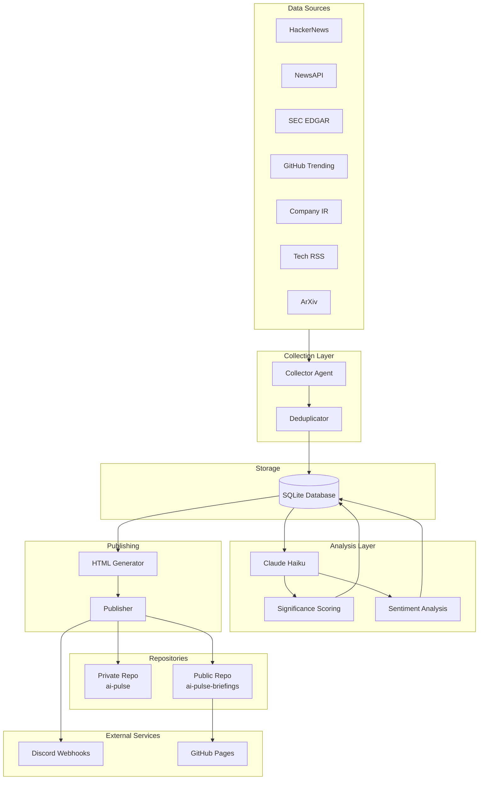
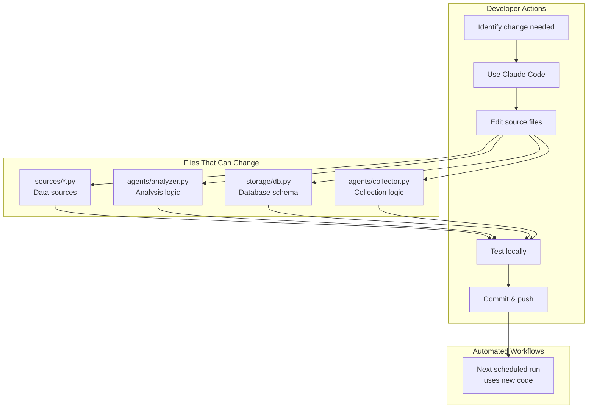
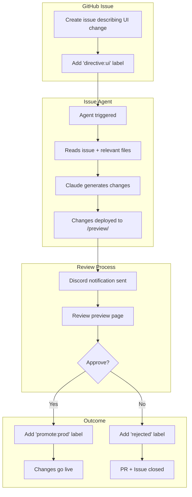
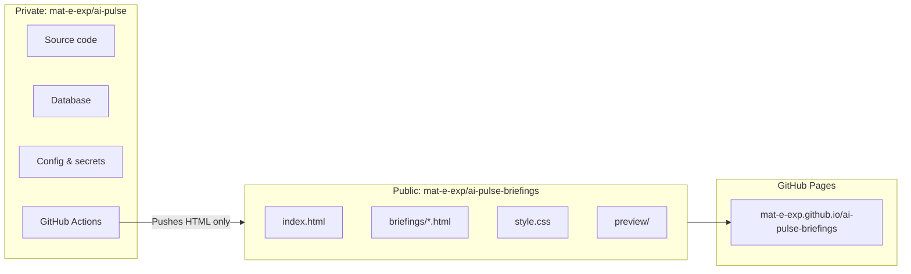
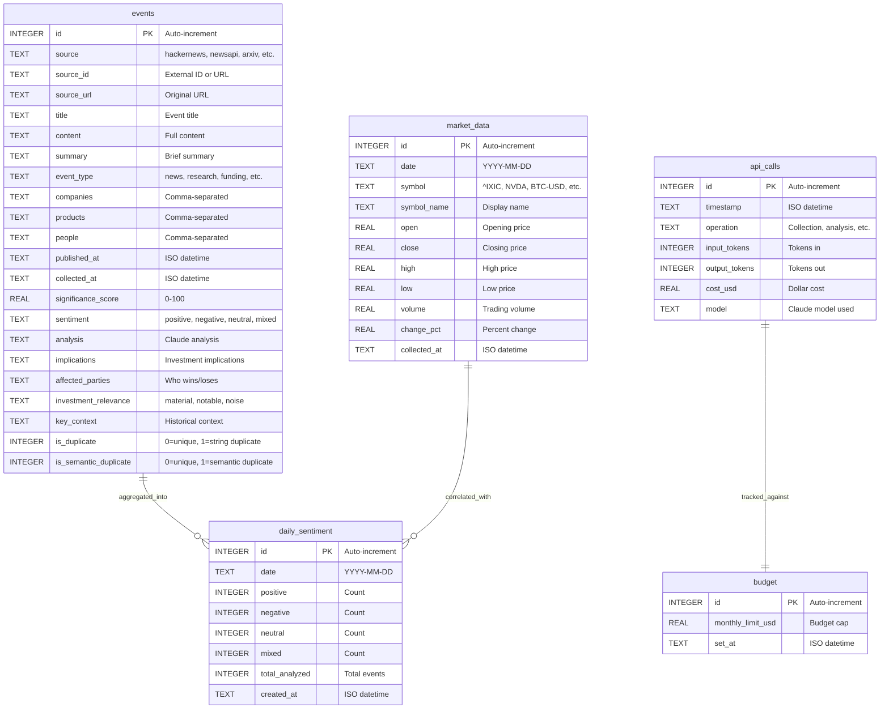
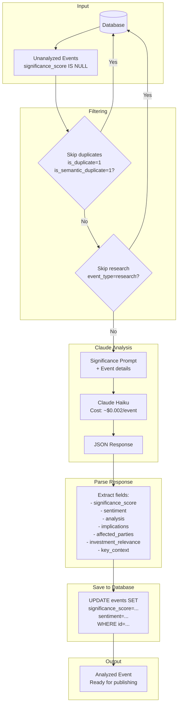

# AI-Pulse System Diagrams

## 1. Architecture Component Diagram

Shows the system components and data flow.



## 2. Daily User Workflow

Shows what happens from a user's perspective through the day.

```mermaid
flowchart LR
    subgraph Morning["6am GMT"]
        A1[Overnight news collected]
        A2[Events analyzed]
        A3[Discord: Top 10 stories]
    end

    subgraph Afternoon["1:30pm GMT"]
        B1[New events collected]
        B2[Delta analyzed]
        B3[Full briefing published]
        B4[Discord: Briefing link]
    end

    subgraph Evening["9:30pm GMT Mon-Fri"]
        C1[Market data collected]
        C2[Correlation calculated]
        C3[Briefing updated]
        C4[Discord: Market update]
    end

    A1 --> A2 --> A3
    A3 -.-> B1
    B1 --> B2 --> B3 --> B4
    B4 -.-> C1
    C1 --> C2 --> C3 --> C4
```



## 3. Data Change Process

How to modify data sources, schema, or analysis logic. Uses Claude Code directly (not the agent).



## 4. UI Change Process (Issue Agent)

How the issue-driven agent handles UI/visual changes automatically.



## 5. Repository Structure

Shows the split between private and public repositories.



## 6. Deduplication Flow (5 Layers)

Shows how events are deduplicated through multiple layers before publication.

```mermaid
flowchart TD
    subgraph Sources["Data Sources"]
        HN[Hacker News<br/>Item IDs]
        NEWS[NewsAPI<br/>Article URLs]
        ARXIV[ArXiv<br/>Paper URLs]
        RSS[Tech RSS<br/>Article URLs]
    end

    subgraph L1["Layer 1: Database UNIQUE Constraint"]
        DB_CHECK{UNIQUE<br/>(source, source_id)?}
        DB_PASS[✓ New Event]
        DB_BLOCK[✗ Duplicate<br/>Already in DB]
    end

    subgraph L2["Layer 2: Source-Level URL Tracking"]
        URL_CHECK{URL seen<br/>this run?}
        URL_PASS[✓ First occurrence]
        URL_BLOCK[✗ Cross-category<br/>duplicate]
    end

    subgraph L3["Layer 3: Content Similarity (75%)"]
        SIM_CHECK{Title similarity<br/>≥75% OR<br/>≥60% + companies?}
        SIM_PASS[✓ Unique content]
        SIM_BLOCK[✗ Same story<br/>different source]
    end

    subgraph L4["Layer 4: Semantic Dedup (Claude)"]
        SEM_CHECK{Claude: Same<br/>underlying event?}
        SEM_PASS[✓ Unique event]
        SEM_BLOCK[✗ Semantic duplicate<br/>is_semantic_duplicate=1]
    end

    subgraph L5["Layer 5: Publishing Filter"]
        PUB_CHECK{is_duplicate=0<br/>AND<br/>is_semantic_duplicate=0?}
        PUB_PASS[✓ PUBLISHED]
        PUB_BLOCK[✗ Not shown]
    end

    Sources --> DB_CHECK
    DB_CHECK -->|New| DB_PASS
    DB_CHECK -->|Exists| DB_BLOCK
    DB_PASS --> URL_CHECK
    URL_CHECK -->|First| URL_PASS
    URL_CHECK -->|Seen| URL_BLOCK
    URL_PASS --> SIM_CHECK
    SIM_CHECK -->|Unique| SIM_PASS
    SIM_CHECK -->|Similar| SIM_BLOCK
    SIM_PASS --> SEM_CHECK
    SEM_CHECK -->|Unique| SEM_PASS
    SEM_CHECK -->|Duplicate| SEM_BLOCK
    SEM_PASS --> PUB_CHECK
    SEM_BLOCK --> PUB_CHECK
    PUB_CHECK -->|Yes| PUB_PASS
    PUB_CHECK -->|No| PUB_BLOCK
```

**ArXiv Special Case**: `source_id = NULL` (Layer 1 doesn't protect)
- **Safe because**: Layer 2 URL dedup + Layer 3 content similarity + RSS returns today's papers only

## 7. Database Schema

Shows the core tables and their relationships.



**Key Constraints:**
- `events`: `UNIQUE(source, source_id)` - Prevents duplicate collection
- `market_data`: `UNIQUE(date, symbol)` - One entry per symbol per day
- `daily_sentiment`: `UNIQUE(date)` - One aggregate per day

**Indexes:**
- `events`: `idx_collected_at`, `idx_event_type`, `idx_significance`
- Fast queries for recent events, research papers, top-scoring events

## 8. Collection Timing & Workflow

Shows automated workflow schedule and data flow.

```mermaid
gantt
    title Daily Automated Workflows (GMT)
    dateFormat HH:mm
    axisFormat %H:%M

    section Morning (6am)
    Collect News           :a1, 06:00, 3m
    Semantic Dedup         :a2, after a1, 2m
    Analyze Events         :a3, after a2, 5m
    Discord: Top 10        :a4, after a3, 1m

    section Afternoon (1:30pm)
    Collect Delta          :b1, 13:30, 3m
    Semantic Dedup         :b2, after b1, 2m
    Analyze New Events     :b3, after b2, 5m
    Publish Briefing       :b4, after b3, 2m
    Discord: Briefing Link :b5, after b4, 1m

    section Evening (9:30pm Mon-Fri)
    Collect Market Data    :c1, 21:30, 2m
    Update Correlation     :c2, after c1, 1m
    Publish Updated Brief  :c3, after c2, 2m
    Discord: Market Update :c4, after c3, 1m
```



**Flow:**

```
6am GMT (Morning Collection)
  ↓ Collect from 7 sources (HN, NewsAPI, RSS, ArXiv, SEC, GitHub, IR)
  ↓ Semantic deduplication (Layer 4)
  ↓ Analyze with Claude Haiku (significance + sentiment)
  ↓ Discord notification: Top 10 stories
  ↓ Database committed

1:30pm GMT (Afternoon Publish)
  ↓ Collect any new events since 6am
  ↓ Semantic deduplication
  ↓ Analyze new events
  ↓ Publish HTML briefing (--days 7 --min-score 40)
  ↓ Push to GitHub Pages
  ↓ Discord notification: Briefing link

9:30pm GMT Mon-Fri (Market Close)
  ↓ Collect market data (11 symbols: indices, stocks, ETFs, crypto)
  ↓ Calculate sentiment-market correlation
  ↓ Update briefing with market data
  ↓ Push to GitHub Pages
  ↓ Discord notification: Market update
```

## 9. Analysis Pipeline

Shows how events are scored and analyzed by Claude.



**Key Points:**
- Research papers (ArXiv) are NOT analyzed (informational, not sentiment-driven)
- Duplicates are skipped (analysis already done on first occurrence)
- Haiku model keeps costs low (~$3/month for 50 events/day)
- Analysis stored in database for repeated publishing without re-analysis
