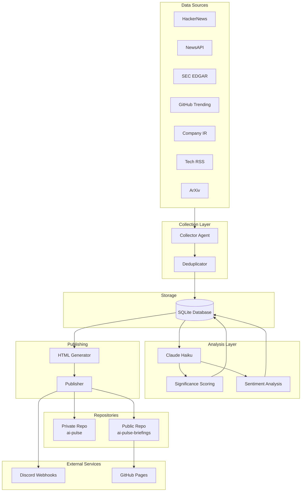
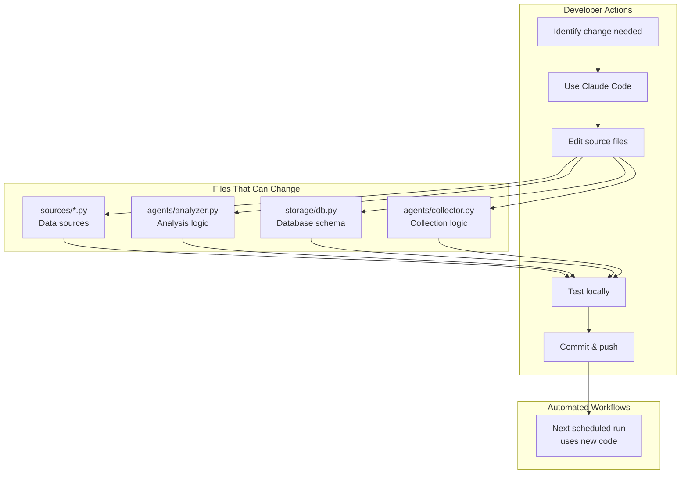
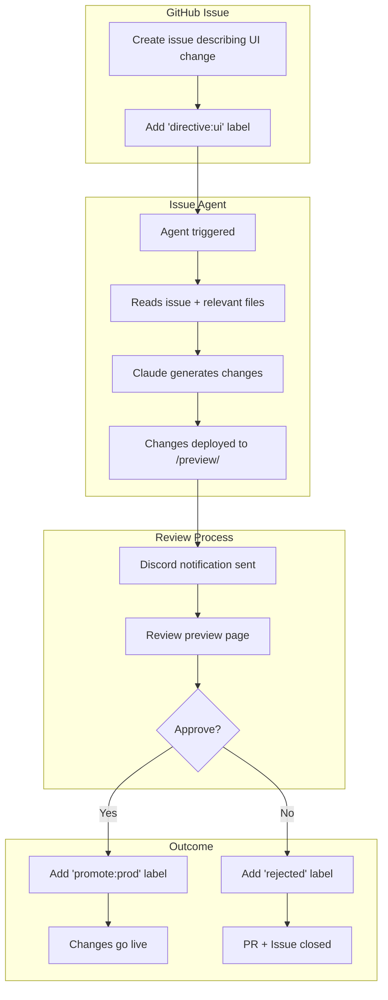
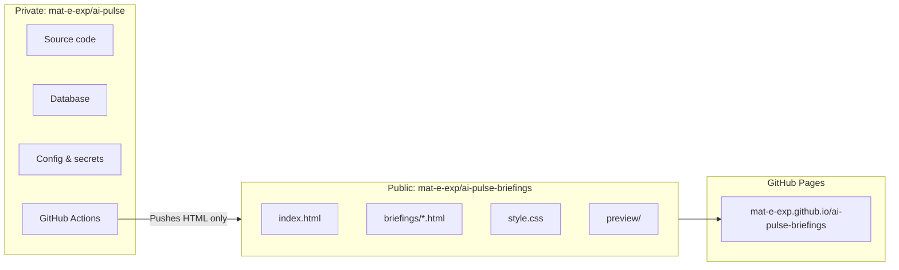

# AI-Pulse System Diagrams

## 1. Architecture Component Diagram

Shows the system components and data flow.

## 2. Daily User Workflow

Shows what happens from a user's perspective through the day.

```mermaid
flowchart LR
    subgraph Morning["6am GMT"]
        A1[Overnight news collected]
        A2[Events analyzed]
        A3[Discord: Top 10 stories]
    end

    subgraph Afternoon["1:30pm GMT"]
        B1[New events collected]
        B2[Delta analyzed]
        B3[Full briefing published]
        B4[Discord: Briefing link]
    end

    subgraph Evening["9:30pm GMT Mon-Fri"]
        C1[Market data collected]
        C2[Correlation calculated]
        C3[Briefing updated]
        C4[Discord: Market update]
    end

    A1 --> A2 --> A3
    A3 -.-> B1
    B1 --> B2 --> B3 --> B4
    B4 -.-> C1
    C1 --> C2 --> C3 --> C4
```

## 3. Data Change Process

How to modify data sources, schema, or analysis logic. Uses Claude Code directly (not the agent).

## 4. UI Change Process (Issue Agent)

How the issue-driven agent handles UI/visual changes automatically.

## 5. Repository Structure

Shows the split between private and public repositories.

